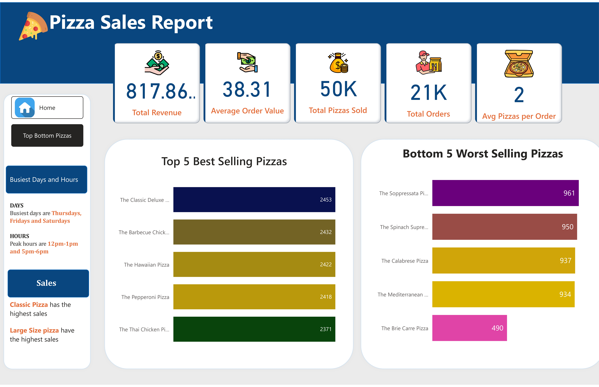

# Pizza Sales Portfolio Project – SQL & Power BI

### Problem Statement:

**Pizza Place Inc.** needed a comprehensive data-driven approach to understand its sales performance and customer behaviours. The company sought answers to key business questions, including:

- **How much revenue did we generate this year?**
- **What is the average order value and total pizzas sold?**
- **What are the daily and hourly sales trends?**
- **Which pizza categories and sizes drive the most sales?**
- **Which pizzas are the best and worst sellers?**

### Data source:
I got the data from https://www.kaggle.com/datasets/mysarahmadbhat/pizza-place-sales

A zip file is also included in this repository.
### How I would solve the problem
I will use Microsoft SQL Server Management Studio (SSMS) to clean and transform the data, focusing on KPIs such as **Total Revenue**, **Average Order Value**, and **Total Orders**. Afterwards, I’ll create a Power BI report to highlight daily and hourly sales trends. The report will break down pizza sales by category and size, showcasing the top 5 best and worst sellers. The insights from this analysis will help optimize inventory, focus promotions, and adjust the product mix to improve profitability.

### Steps I Took

- I launched SSMS and created a new database called pizza_sales.
- I imported the four flat files(order_details, orders, pizza_types and pizzas) into the database.
- Changed the data to the appropriate data type and performed data exploration to understand the data.
- Exported the data and imported it into Power BI.

### Queries Used

You can download all the full queries from the SQL file in this repository. Below is a summary of the main queries:

```sql
## Database Setup
```sql
USE pizza_sales;
```

## KPI Queries

### 1. Total Revenue
```sql
SELECT ROUND(SUM(quantity * price), 2) AS [Total Revenue]
FROM order_details AS o
JOIN pizzas AS p ON o.pizza_id = p.pizza_id;
```

### 2. Average Order Value
```sql
SELECT ROUND(SUM(quantity * price) / COUNT(DISTINCT order_id), 2) AS [Average Order Value]
FROM order_details AS o
JOIN pizzas AS p ON o.pizza_id = p.pizza_id;
```

### 3. Total Pizzas Sold
```sql
SELECT SUM(quantity) AS [Total Pizzas Sold]
FROM order_details;
```

### 4. Total Orders
```sql
SELECT COUNT(DISTINCT order_id) AS [Total Orders]
FROM order_details;
```

### 5. Average Pizzas per Order
```sql
SELECT SUM(quantity) / COUNT(DISTINCT order_id) AS [Average Pizzas Per Order]
FROM order_details;
```

## Business Insights

### 6. Daily Trends for Total Orders
```sql
SELECT FORMAT(date, 'dddd') AS DayOfWeek, COUNT(DISTINCT order_id) AS total_orders
FROM orders
GROUP BY FORMAT(date, 'dddd')
ORDER BY total_orders DESC;
```

### 7. Hourly Trends for Total Orders
```sql
SELECT DATEPART(HOUR, time) AS [Hour], COUNT(DISTINCT order_id) AS [COUNT]
FROM orders
GROUP BY DATEPART(HOUR, time)
ORDER BY [Hour];
```

### 8. Percentage of Sales by Pizza Category
```sql
SELECT category, SUM(quantity * price) AS Revenue,
ROUND(SUM(quantity * price) * 100 / (SELECT SUM(quantity * price) FROM pizzas AS p2
JOIN order_details AS od2 ON od2.pizza_id = p2.pizza_id), 2) AS percentage_Sales
FROM pizzas AS p
JOIN pizza_types AS pt ON p.pizza_type_id = pt.pizza_type_id
JOIN order_details AS od ON od.pizza_id = p.pizza_id
GROUP BY category
ORDER BY percentage_Sales DESC;
```

### 9. Percentage of Sales by Pizza Size
```sql
SELECT size, SUM(quantity * price) AS Revenue,
ROUND(SUM(quantity * price) * 100 / (SELECT SUM(quantity * price) FROM pizzas AS p2
JOIN order_details AS od2 ON od2.pizza_id = p2.pizza_id), 2) AS percentage_Sales
FROM pizzas AS p
JOIN pizza_types AS pt ON p.pizza_type_id = pt.pizza_type_id
JOIN order_details AS od ON od.pizza_id = p.pizza_id
GROUP BY size
ORDER BY percentage_Sales DESC;
```

### 10. Total Pizzas Sold by Pizza Category
```sql
SELECT category, SUM(quantity) AS quantity_sold
FROM pizzas AS p
JOIN pizza_types AS pt ON p.pizza_type_id = pt.pizza_type_id
JOIN order_details AS od ON od.pizza_id = p.pizza_id
GROUP BY category
ORDER BY SUM(quantity) DESC;
```

### 11. Top 5 Best Sellers by Total Pizzas Sold
```sql
SELECT TOP 5 name, SUM(quantity) AS total_pizzas_sold
FROM pizzas AS p
JOIN pizza_types AS pt ON p.pizza_type_id = pt.pizza_type_id
JOIN order_details AS od ON od.pizza_id = p.pizza_id
GROUP BY name
ORDER BY total_pizzas_sold DESC;
```

### 12. Bottom 5 Worst Sellers by Total Pizzas Sold
```sql
SELECT TOP 5 name, SUM(quantity) AS total_pizzas_sold
FROM pizzas AS p
JOIN pizza_types AS pt ON p.pizza_type_id = pt.pizza_type_id
JOIN order_details AS od ON od.pizza_id = p.pizza_id
GROUP BY name
ORDER BY total_pizzas_sold ASC;
```

### Data Visualization


---



### Findings:
- **Total Revenue:** $817,860
- **Average Order Value:** $38.31
- **Total Pizzas Sold:** 50,000 (21,000 orders, 2 pizzas/order)

### Key Insights:
- **Busiest Days:** Thursday (3,239 orders), Friday (3,538 orders), and Saturday (3,158 orders)
- **Peak Hours:** 12-1 PM and 5-7 PM
- **Top Pizza Category:** Classic (26.91% sales)
- **Best-Selling Size:** Large (45.89%)
- **Top 5 Best Sellers:** Classic Deluxe, Barbecue Chicken, Hawaiian, Pepperoni, Thai Chicken
- **Bottom 5 Sellers:** Brie Carre, Mediterranean, Calabrese, Spinach Supreme, Soppressata

These insights will guide strategic decisions regarding inventory, menu adjustments, and promotional activities to maximize profitability and customer satisfaction.
